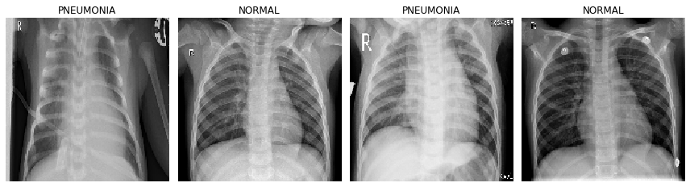
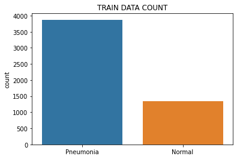
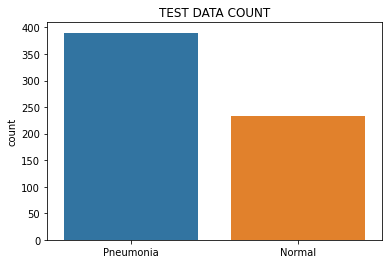
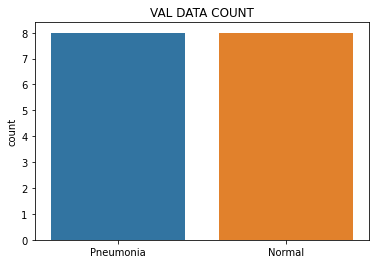
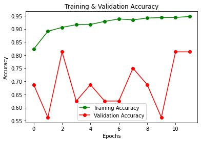
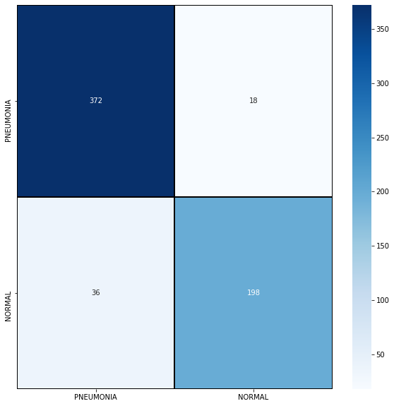

# Convolutional-Neural-Network

## Image classification - chest xray's. Have pneumonia or not ?

## Train/Val/Test Data 

## Performance

## Requirements

Python 3

Anaconda-navigator/ Jupyter Notebook or any other similar to run ipynb file  (Not mandatory) (.py file is also included)
